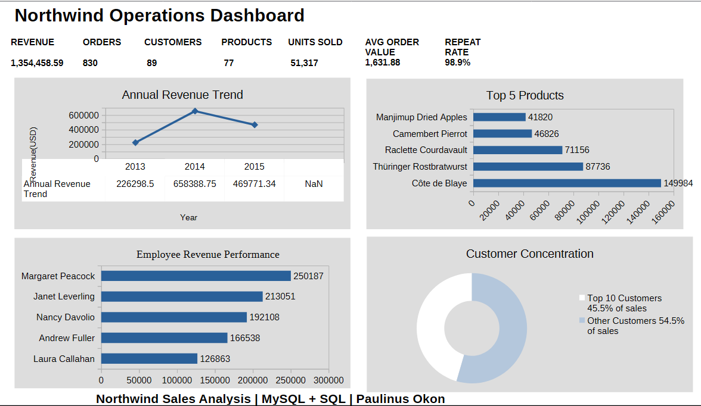
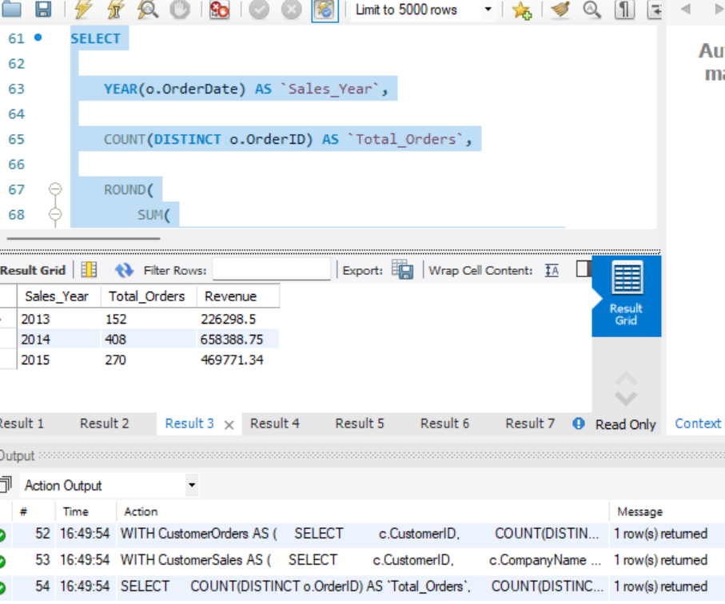
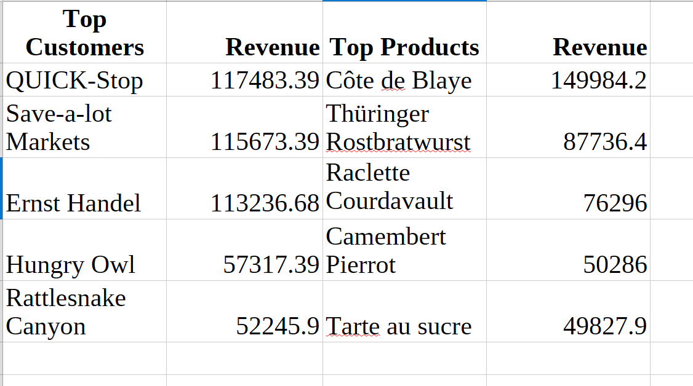
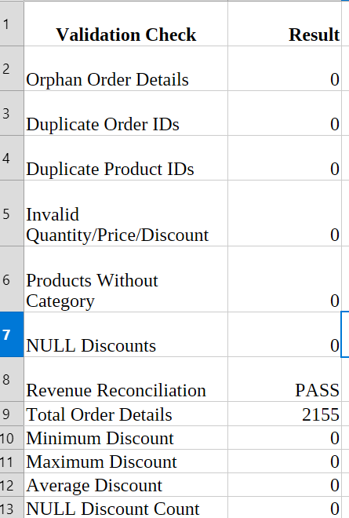

# Northwind Sales & Business Performance Analysis

## 📊 Project Overview
This project provides a comprehensive business intelligence and database analysis solution utilizing the classic Northwind database. It explores sales dynamics, product performance, employee efficiency, and data quality metrics to drive strategic growth and operational improvements.

### Business Questions Addressed
* What are our primary macroeconomic revenue drivers and monthly sales trends?
* Which products, categories, and customer segments yield the highest profitability?
* How are individual employees performing regarding sales generation and account management?
* Are there operational anomalies or data quality issues affecting our reporting accuracy?

### Tools Used
* **SQL** – Core data exploration, deep metric extraction, and business logic staging.
* **Power BI / Analytical Reporting** – Interactive dashboard mockups, data transformation visualization, and executive reporting.

---

## 📈 Key Performance Indicators (KPIs)
* **Total Sales Revenue** – Aggregated global revenue across territories.
* **Order Volumes & Frequency** – Tracking monthly transaction velocities.
* **Product Sales Performance** – Revenue and sales contribution across products and categories.
* **Employee Sales Performance** – Comparative revenue generated by each sales representative.

---

## 🖥️ Dashboard Views

The analytical outputs are mapped across four core strategic lenses:

### 1. Executive Overview
High-level summary of company performance, strategic milestones, revenue tracking, and global business indicators.


### 2. Revenue Analysis
Granular analysis of revenue trends, regional sales performance, seasonal patterns, and business growth trends.


### 3. Customer & Product Analysis
Deep dive into product and category performance, customer purchasing behavior, and sales distribution.


### 4. Data Quality Validation
Dedicated framework isolating system discrepancies, missing database values, or pipeline anomalies to secure single-source-of-truth accuracy.



---

## 🔎 Key Findings

The analysis of the Northwind database produced the following business insights:

* **Sales Performance:** The analysis covered **830 orders**, generating total sales revenue of **1,354,458.59** across **51,317 units sold**.

* **Customer Base:** The dataset contains **89 customers**, with **98.9% of customers making repeat purchases**, indicating strong customer retention within the analyzed period.

* **Average Order Value:** The average order generated approximately **1,631.88** in sales revenue.

* **Revenue Concentration:** The **top 10 customers contributed approximately 45.5% of total revenue**, highlighting the importance of key customer accounts to overall sales performance.

* **Product Performance:** **Côte de Blaye** was the highest-revenue product, generating approximately **149,984.20** in sales.

* **Yearly Revenue Trend:** Revenue increased substantially from **226,298.50 in 2013** to **658,388.75 in 2014**, before declining to **469,771.34 in 2015**.

* **Business Implication:** The concentration of revenue among leading customers and products suggests opportunities to strengthen key-account relationships while identifying strategies to improve sales across lower-performing segments.

---

## 💡 Analysis Performed & Repository Roadmap

The operational development of this project is fully itemized and reproducible via the staged directories in this repository:

### 🗄️ SQL Analysis Phase
The processing scripts located in the `/SQL` directory address modular analysis requirements:
* `01_Data_Exploration.sql` – Baseline schema audit and structural data layout reviews.
* `02_Sales_Performance.sql` – Calculation of high-level transaction records and overall growth.
* `03_Customer_Analysis.sql` – Aggregations tracking buying behavior and customer value tierings.
* `04_Product_Analysis.sql` – Isolating individual inventory lines driving the bottom-line metrics.
* `05_Employee_Performance.sql` – Ranking organizational sales impact per account manager.
* `06_Executive_Summary.sql` – Formulating performance metrics for high-level business briefings.
* `07_Data_Quality_Validation.sql – Validating data completeness, consistency, duplicates, and potential integrity issues.
* `08_Final_Business_Findings.sql` – Final synthesized reporting views.

### 📝 Project Documentation
* Refer to the comprehensive documentation assets under `/Documentation` (including the business analysis layouts: `Northwind_Executive_Business_Analysis.pdf`) to review the conceptual framework and reporting background behind these data outputs.

---

## 📁 Project Structure

```text
Northwind-Sales-Analysis/
├── Dashboard/
│   ├── Northwind_Executive_Dashboard.odp
│   └── Northwind_Executive_Dashboard.pdf
├── Documentation/
│   ├── Northwind_Executive_Business_Analysis.odt
│   └── Northwind_Executive_Business_Analysis.pdf
├── Images/
│   ├── 01_Executive_Dashboard.png
│   ├── 02_Revenue_Analysis.png
│   ├── 03_Customer_Product_Analysis.png
│   └── 04_Data_Quality_Validation.png
├── SQL/
│   ├── 01_Data_Exploration.sql
│   ├── 02_Sales_Performance.sql
│   ├── 03_Customer_Analysis.sql
│   ├── 04_Product_Analysis.sql
│   ├── 05_Employee_Performance.sql
│   ├── 06_Executive_Summary.sql
│   ├── 07_Data_Quality_Validation.sql
│   └── 08_Final_Business_Findings.sql
└── README.md
```

---

## 📊 Dataset Reference
The structural core of this portfolio piece leverages the **Northwind Database**, an industry-standard transactional dataset charting international trading operations, shipping logistics, inventory lines, customer channels, and historical employee metrics.

## ⚠️ Limitations & Analytical Notes
* **Historical Constraints:** The analysis is based purely on the static timeline boundaries present inside the original source database architecture.
* **Correlative Assertions:** All identified trends serve as directional business indicators and operational performance relationships rather than definitive proofs of transactional causation.

